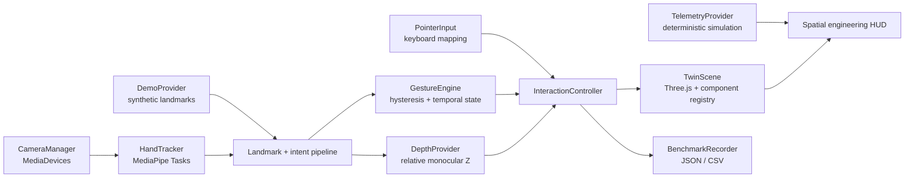

# Spatial Digital Twin Interface

A real-time spatial human–machine interface for exploring robotic digital twins with commodity cameras, natural hand gestures, monocular relative depth, telemetry, and Three.js.

This is the modern successor to the original **Stark Hologram** prototype. It keeps the useful spatial interaction ideas while replacing the Flask/Orbbec-specific stack, monolithic JavaScript, vendored libraries, and generic building model with a typed, browser-native robotics architecture. The visual language is original: technical cyan geometry, amber state cues, and an engineering HUD—not copied movie assets.

> **Project status — v0.2 modernization:** the procedural robot, component tools, input fallbacks, camera manager, MediaPipe hand pipeline, gesture state machine, relative-depth estimator, simulated telemetry, diagnostics, benchmark export, onboarding, and deterministic demo are implemented. Telemetry is explicitly simulated. Real robot, ROS, TrueDepth, and metric depth integrations are future work.

## Try it without hardware

```bash
npm ci
npm run dev
```

Open `http://127.0.0.1:5173/?demo=1`, or choose **Try demo** in the interface. The 12-second deterministic sequence sends synthetic 21-landmark hands through the same gesture, relative-depth, overlay, and interaction pipeline used by a live camera.

No camera, robot, backend, iPhone, depth sensor, or paid service is required.

## Core capabilities

- Standards-based multi-camera discovery and switching through `navigator.mediaDevices`
- Browser camera, built-in webcam, USB webcam, and virtual-camera support without vendor-specific code
- Current MediaPipe Tasks Hand Landmarker integration for up to two hands, handedness, 21 image landmarks, world landmarks, frame timestamps, and measured inference timing
- EMA landmark smoothing, extreme-jump protection, pinch hysteresis, candidate/confirmation/release states, temporal gating, and dominant-hand preference
- Honest monocular **relative Z** from multiple apparent hand-scale features, with automatic/saved baseline, dead zone, smoothing, bounds, stability estimate, and tracking-loss handling
- Procedural articulated robot cell plus local GLB/URL GLB-glTF import, semantic component discovery, raycast/keyboard selection, highlighting, isolation, visibility control, and exploded view
- Deterministic simulated telemetry bound to selected components
- Holographic, blueprint, solid, and diagnostic render modes
- Mouse and keyboard fallbacks, responsive layout, onboarding, audio controls, and camera-denied/demo paths
- Measured camera/vision/gesture/depth/render diagnostics and raw JSON/CSV session export

## Interaction map

| Input                 | Action                                        |
| --------------------- | --------------------------------------------- |
| Point                 | Aim at a component                            |
| Pinch and hold        | Confirm selection and start a grab            |
| Move confirmed pinch  | Translate X/Y                                 |
| Move hand toward/away | Translate normalized relative Z               |
| Two confirmed pinches | Rotate, scale, and explode                    |
| Two open palms, held  | Reset                                         |
| Click / drag          | Select / translate X/Y                        |
| Wheel / Ctrl-wheel    | Translate Z / scale                           |
| Shift-drag            | Rotate                                        |
| `E`                   | Toggle exploded view                          |
| `H` / `B` / `S` / `D` | Holographic / blueprint / solid / diagnostics |
| `R` / `F` / `?`       | Reset / fullscreen / controls                 |

## Architecture



The core provider boundaries are deliberately small and exercised by real implementations:

- `CameraProvider`: browser camera lifecycle and device changes
- `DepthProvider`: normalized relative-Z readings; replaceable by recorded, TrueDepth, or external depth sources later
- `TelemetryProvider`: deterministic simulation and recorded playback
- `InputProvider`: pointer lifecycle, with pure keyboard command mapping

See [architecture](docs/architecture.md) for ownership and data flow.

## Relative depth: what it means

This build does **not** report metres. It derives a robust apparent palm scale from several normalized landmark distances, compares that scale with a stable neutral baseline, clamps the result to `[-1, +1]`, applies a dead zone, then filters it over time.

`RELATIVE Z +0.28` means displacement relative to the calibrated neutral pose. It is useful for interaction but is not a physical range measurement. See [relative depth](docs/relative-depth.md) for the formula, assumptions, and limitations.

## Camera setup

1. Choose **Camera**.
2. Select a source and capture resolution.
3. Set dominant-hand and mirror preferences.
4. Start the camera and grant access when the browser asks.
5. Hold one hand neutral and still while the relative-Z baseline stabilizes.

An iPhone 13 or iPad exposed by Camo or another standards-compliant virtual-camera tool appears like any other browser camera. Device labels are provided by the browser/driver; the app does not claim to identify an iPhone when only a generic label is available.

Camera frames stay in the browser and are not uploaded by this project. The Hand Landmarker WASM and model are fetched from pinned Google/MediaPipe distribution URLs on first use. Demo and non-vision controls remain available if that download is unavailable. More detail: [camera and privacy](docs/camera.md).

## Diagnostics and experiment capture

Press `D` or choose **Open measured diagnostics**. The panel reports only runtime observations that the app can actually measure or read:

- browser-reported camera resolution/frame rate;
- MediaPipe inference time, tracking loop rate, handedness score when available, and hand count;
- gesture state, hold duration, and clearly labelled heuristic quality;
- palm-scale inputs, raw/filtered relative Z, baseline, and stability estimate;
- Three.js render FPS, triangle count, and registered component count;
- active tracking and telemetry sources.

Recording is opt-in and exports raw session observations as versioned JSON or CSV. The app does
not capture camera frames, audio, or landmark coordinates, does not upload the export, and does not
calculate or claim benchmark results. Device labels, notes, and interaction timing may still be
sensitive: obtain consent, avoid participant names, and handle files under the study's retention
policy. The reproducible hardware protocol and capture checklist are in
[benchmarking](docs/benchmarking.md).

## Development

Requires Node.js 22.13 or newer (Vitest 5's supported runtime floor).

```bash
npm ci
npm run dev
npm run test:run
npm run test:e2e
npm run typecheck
npm run lint
npm run build
npm run check
```

`npm run check` runs type checking, linting, unit tests, and the production build. CI runs the same gate from the lockfile.

## Project structure

```text
src/
  audio/          synthesized, optional UI cues
  benchmark/      raw observation recorder/export
  calibration/    versioned local profile
  camera/         CameraProvider and MediaDevices manager
  demo/           deterministic synthetic hand session
  depth/          DepthProvider and relative-Z estimator
  digital-twin/   component registry and procedural robot
  gestures/       pure recognizers, math, state machine
  input/          pointer provider and keyboard mapping
  interaction/    gesture/depth to twin transforms
  rendering/      Three.js scene, selection, modes, GLTF loading
  telemetry/      simulation/recorded providers
  vision/         Hand Landmarker, smoothing, overlay, types
```

The old Flask server, broken Orbbec bridge, Python requirements, duplicate vendored Three.js copies, legacy MediaPipe globals, and `static/app.js` are preserved in Git history rather than active source.

## Documentation

- [Architecture](docs/architecture.md)
- [Camera and privacy](docs/camera.md)
- [Gesture engine](docs/gestures.md)
- [Relative depth](docs/relative-depth.md)
- [Digital twin](docs/digital-twin.md)
- [Demo mode](docs/demo-mode.md)
- [Benchmark protocol](docs/benchmarking.md)
- [Portfolio and research notes](docs/portfolio.md)
- [Dependencies and asset licensing](docs/dependencies.md)

## Limitations

- Monocular relative depth is pose- and camera-dependent and is intentionally non-metric.
- MediaPipe model initialization currently needs network access; inference is then local in the browser.
- Camera and inference performance depends on the browser, camera driver, lighting, and CPU/GPU.
- This session did not physically validate iPhone/Camo, iPad, or generic webcam paths; the required manual matrix is documented.
- Local GLB and CORS-enabled GLB/glTF URL import are available from settings. Imported meshes receive semantic fallbacks, safe cloned materials, automatic centering/scaling, selection, disposal, and procedural fallback. The repository still carries no third-party robot-asset licensing burden.
- Telemetry is simulated and clearly labelled; there is no live robot connectivity yet.

## Roadmap

1. Run and publish the documented camera/distance/lighting study without fabricating results.
2. Validate contributor-supplied industrial GLB assets and refine semantic metadata conventions.
3. Move MediaPipe inference to a worker if measured UI contention justifies it.
4. Add a consented, privacy-reviewed landmark-session format only if deterministic synthetic replay is insufficient.
5. Implement provider adapters for ROS 2/WebSocket/MQTT telemetry.
6. Explore native TrueDepth, mobile orientation, WebXR, and learned temporal classifiers as separate research tracks.

The version progression is tracked in [CHANGELOG.md](CHANGELOG.md); future milestones are plans, not completed releases.

## Contributing and security

See [CONTRIBUTING.md](CONTRIBUTING.md) for the workflow and [SECURITY.md](SECURITY.md) for private vulnerability reporting and camera/privacy expectations.

## License

[ISC](LICENSE) © 2026 adeel1608.
