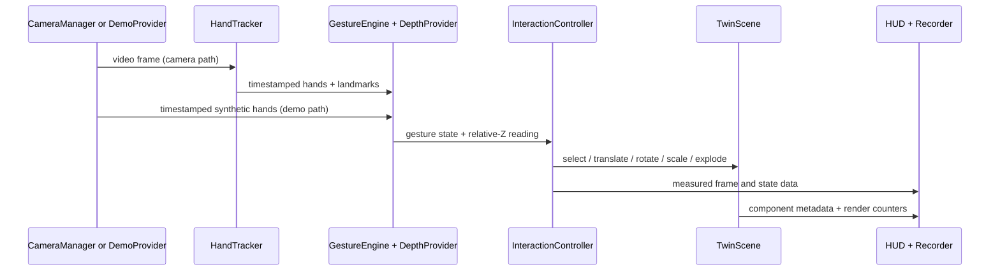

# Architecture

## Goals

The application is a local-first spatial HMI, not a conventional form-heavy web app. The rendering loop must remain independent from camera availability, and camera/tracking failures must not prevent users from exploring the digital twin.

## Runtime flow

`main.ts` is the composition root. It wires lifecycle events and view updates but leaves recognition, filtering, state transitions, telemetry math, and component lookup in testable modules.

## Provider boundaries

### CameraProvider

`CameraManager` owns enumeration, standard constraints, saved preferences, clean switching/stopping, track-end handling, and `devicechange` notification. It deliberately knows nothing about Camo, iPhone, or Orbbec.

### DepthProvider

`RelativeDepthProvider` consumes a tracked hand and emits a normalized reading. `InteractionController` depends on the interface rather than sensor-specific units, leaving room for a recorded provider or a future native/external depth adapter.

### TelemetryProvider

The interface exposes timestamped channel samples plus pause/resume/reset. The deterministic simulation and recorded playback providers share it. A WebSocket/REST/ROS adapter can be added without changing the inspector.

### InputProvider

The pointer provider owns reversible event registration. Keyboard commands are a pure map and feed the same scene methods. Camera gestures and demo landmarks converge in `InteractionController`.

## State ownership

- Camera and vision lifecycle: camera/vision modules
- Gesture temporal state: `GestureEngine`
- Depth baseline and filters: `RelativeDepthProvider`
- Component transforms, selection, visibility, materials: `TwinScene`
- Local setup serialization: `CalibrationStore`
- Raw experiment observations: `BenchmarkRecorder`
- UI composition and modal flows: `main.ts`

No backend is required. Browser storage contains preferences only. Exported observations leave the browser only through an explicit download action.

## Extensibility boundaries

Future TrueDepth, external depth, ROS 2, MQTT, WebXR, or learned gesture classifiers should enter through provider/adaptor boundaries. Native mobile capture would be a separate companion, not a reason to couple the browser core to an Apple-only API.

## Three.js resource ownership

`TwinScene` owns the render loop, resize observer, canvas listener, renderer, environment geometry/materials, procedural model, and current imported model. Model replacement is generation-guarded. Imported materials are cloned before visual-mode mutation, original material state is restored between modes, and replaced/final resources are explicitly disposed. The GLTF loader is dynamically imported only when a user requests a model.
