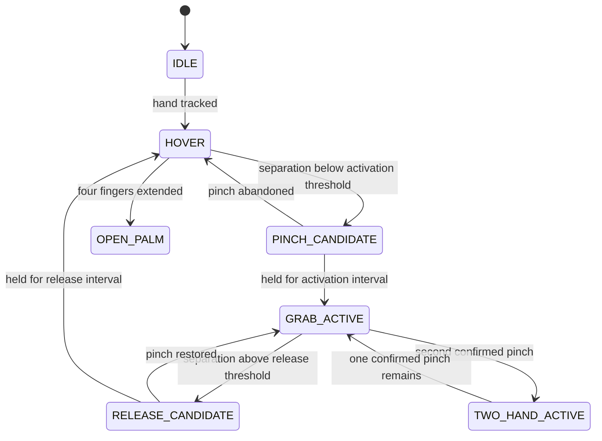

# Gesture engine

The gesture layer is intentionally rule-based and inspectable. It does not claim learned gesture confidence.

## Pinch recognition

Thumb-tip to index-tip distance is divided by a robust palm-scale estimate, making the threshold less dependent on image resolution or hand distance. Activation and release use different ratios:

- activation: `0.24 × palm scale`
- release: `0.34 × palm scale`
- activation hold: 150 ms
- release hold: 90 ms

The displayed quality value is a bounded heuristic derived from normalized pinch separation. It is not a probability.

## State machine

Two held open palms reset the twin. A dominant-hand preference can be automatic, left, or right. Landmark smoothing and jump rejection happen before recognition.

Tracks are matched frame-to-frame by wrist proximity with a small handedness penalty. This keeps a pending gesture stable through an isolated Left/Right label flip without trusting handedness as identity. Complete tracking loss still clears confirmation immediately. After a confirmed release, a short cooldown prevents immediate noisy reactivation. When only the non-dominant hand is actively pinching, that active intent takes priority over an idle preferred hand.

## Interaction mapping

- Single confirmed pinch: raycast once, then translate X/Y and relative Z.
- Two confirmed pinches: separation controls scale, connecting-line angle controls rotation, and midpoint vertical motion controls exploded view.
- Tracking loss clears motion history so reacquisition cannot create a large jump.
- A two-hand to one-hand transition establishes fresh anchors before applying another transform.

All thresholds live in `src/config.ts`; pure recognition and state behavior are unit tested.
